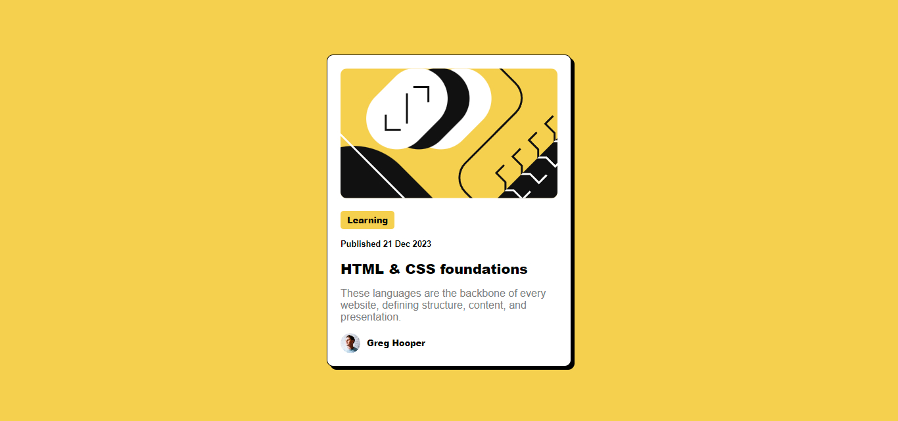

#  Solução para o Blog preview card - Frontend Mentor

Essa é minha solução para o [Blog preview card challenge do Frontend Mentor](https://www.frontendmentor.io/challenges/blog-preview-card-ckPaj01IcS). Os desafios do Frontend Mentor ajudam a melhorar suas habilidades de codificação através da construção de projetos realistas.

## Table of contents

- [Visão Geral](#visão-geral)
  - [O desafio](#o-desafio)
  - [Imagens](#imagens)
  - [Links](#links)
- [Meu processo](#meu-processo)
  - [Tecnologias usadas](#tecnologias-usadas)
  - [Objetivo](#objetivo)
  - [Materias usados](#materias-usados)

## Visão Geral

### O desafio

O desafio consistia em construir um cartão de visualizção de um blog. Os usuários devem ser capazes de:

- Visualizar o layout ideal da interface independente do tamanho da tela do dispositivo usado.
- Visualizar os estados hover e focus de todos os elementos interativos da página.

### Imagens

### Links

- Veja aqui a página: [Blog preview card](https://randyrobson.github.io/blog-preview-frontend-mentor/index.html)

## Meu processo

### Tecnologias usadas

- HTML5 Semântico
- Propriedade CSS personalizadas
- Flexbox
- Conceito Mobile-first

### Objetivo

Exercitar minhas habilidade para crianção de páginas na web. É meu passa-tempo e me divirto bastante.

### Materias usados

- [Curso em Vídeo](https://www.youtube.com/playlist?list=PLHz_AreHm4dkZ9-atkcmcBaMZdmLHft8n) - No curso de HTML5/CSS3 do Guanabara aprendi a usar essas linguagens de marcação e estilização respectivamente.
- [Flex Box Froggy](https://flexboxfroggy.com) - Inicialmente foi com esse jogo que fui introduzido a propriedade FlexBox do HTML5.